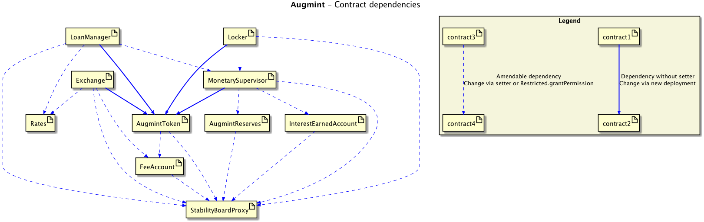

# Augmint - Stable Digital Tokens - Solidity Contracts

Decentralised stable cryptocurrency on Ethereum

## Concept

Decentralized stablecoins targeted to fiat currencies built on Ethereum.

The first Augmint token is AEUR.

**1 AEUR ≈ 1 EUR.**

-   Buy and sell AEUR for ETH or EUR.
-   Get a loan in AEUR by depositing ETH.
-   Lock AEUR to earn a premium.

Try it: **[https://www.augmint.org](http://www.augmint.org)**

**[Manifesto](https://www.augmint.org/manifesto)**

**[White Paper](http://bit.ly/augmint-wp)**

### Related repos

-   [Web frontend](https://github.com/Augmint/augmint-web)
-   [@augmint/js library](https://github.com/Augmint/augmint-js)

## Flow diagrams

-   [Loan flow](docs/loanFlow.png)
-   [Lock flow](docs/lockFlow.png)
-   [Exchange flow](docs/exchangeFlow.png)
-   [Flow of funds](https://docs.google.com/document/d/1IQwGEsImpAv2Nlz5IgU_iCJkEqlM2VUHf5SFkcvb80A/#heading=h.jsbfubuh6okn)

## Solidity Contracts

### Dependencies

### List of contracts

-   [Restricted.sol](./contracts/generic/Restricted.sol)  
    Stores permissions per address
-   [MultiSig.sol](./contracts/generic/MultiSig.sol)  
    Abstract contract to manage multi signature approval and execution of atomic, one-off contract scripts
-   [StabilityBoardProxy.sol](./contracts/generic/StabilityBoardProxy.sol)  
    Augmint parameters can be set only via this contract with a quorum approving a contract script to run.
-   [ERC20.sol](./contracts/generic/ERC20.sol)  
    Standard [ERC20](https://theethereum.wiki/w/index.php/ERC20_Token_Standard) token interface.
-   [SystemAccount.sol](./contracts/generic/ERC20.sol)
    Abstract contract to maintain balances of Augmint system accounts
-   [AugmintReserves](./contracts/AugmintReserves.sol)
    -   Holds Augmint's ETH and token reserves
-   [InterestEarnedAccount](./contracts/InterestEarnedAccount.sol)
    -   Holds interest earning from token lending - only from repaid loans, i.e. already "earned"
    -   Provides interest for Locks
-   [FeeAccount.sol](./contracts/FeeAccount.sol)
    -   holds all fees: tokens from transfer and exchange fees (to be implemented) + ETH fees from defaulting fees
    -   calculates transferFees
-   [AugmintToken.sol](./contracts/generic/AugmintToken.sol)  
    Base contract for all Augmint tokens, [TokenAEur.sol](./contracts/TokenAEur.sol) being the first implementation.
    -   ERC20 standard functions
    -   maintains account token balances
    -   Generic `transferAndNotify` "convenience" function
    -   allows MonetarySupervisor to issue tokens on loan disbursement and for reserve
    -   allows accounts to burn their tokens (used by repay loan and burn from reserves via MonetarySupervisor contract)
-   [MonetarySupervisor.sol](./contracts/MonetarySupervisor.sol)
    -   maintains system wide KPIs (totalLockAmount, totalLoanAmount)
    -   enforces system wide limits (Loan to Deposit ratio limits)
    -   issue to & from reserve functions
-   [TokenAEur.sol](./contracts/TokenAEur.sol)
    -   First AugmintToken contract instance, pegged for pegged to EUR (A-EUR aka Augmint Euro aka A€ )
    -   Sets standard token parameters (name, symbol, decimals, peggedSymbol etc.)
-   [Rates.sol](./contracts/Rates.sol)  
    A contract to return fiat/ETH exchange rates.
-   [Exchange.sol](./contracts/Exchange.sol)  
    EUR / ETH exchange contract. Sell or buy A-EUR for ETH
-   [LoanManager.sol](./contracts/LoanManager.sol)
    -   Loan products and their parameters
    -   Maintains all loans via new loan, repayment, collection functions
    -   Holds collateral in escrow
-   [Locker.sol](./contracts/Lock.sol)
    -   Lock products and parameters
    -   Token funds locking and releasing
    -   Holds locked tokens (with interest)

## Contribution

Augmint is an open and transparent project.

We are seeking for great minds to extend our core team. Contribution in any area is much appreciated: development, testing, UX&UI design, legal, marketing, spreading the word etc.

[Code of Conduct](CODE_OF_CONDUCT.md)

## [Development environment setup](docs/developmentEnvironment.md)

## Get in touch

-   [hello@augmint.org](mailto:hello@augmint.org)
-   [Discord server](https://discord.gg/PwDmsnu) 
-   [Telegram](https://t.me/augmint)

## Authors

See team on [www.augmint.org](https://www.augmint.org)

 The project was born at [DECENT Labs](http://www.decent.org)

### Concept, initial version

-   [szerintedmi](https://github.com/szerintedmi)
-   [Charlie](https://github.com/krosza)

## Licence

This project is licensed under the GNU Affero General Public License v3.0 license - see the [LICENSE](LICENSE) file for details.
